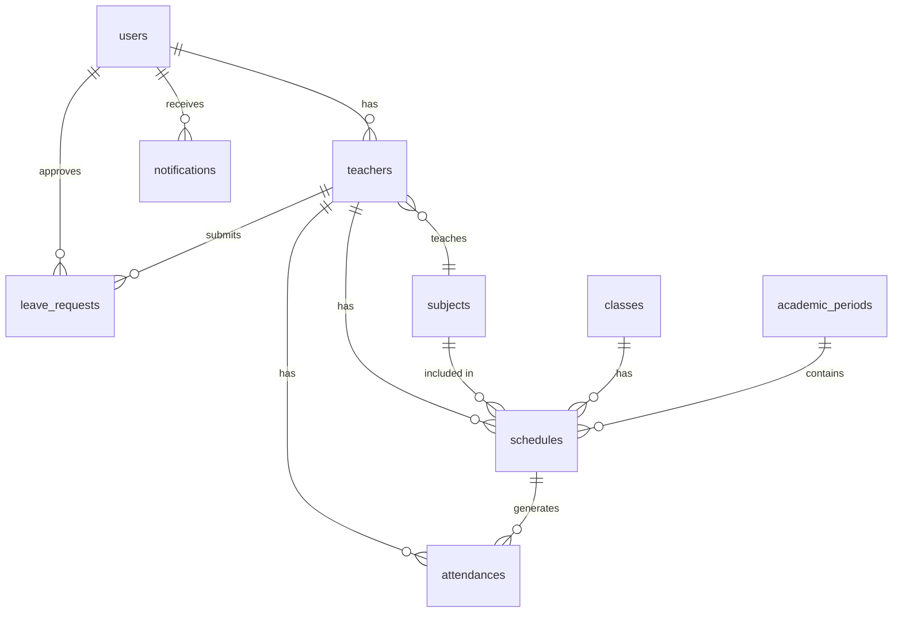

# Struktur Database PocketBase - EduPresence

## Overview
Dokumentasi ini mendeskripsikan struktur database PocketBase untuk aplikasi presensi guru EduPresence berdasarkan analisis UI/UX yang telah dilakukan.

## Daftar Tabel (Collections)

### 1. users
Tabel untuk menyimpan data pengguna sistem (Admin & Guru)

| Field | Type | Required | Unique | Default | Description |
|-------|------|----------|--------|---------|-------------|
| id | text | true | true | auto | Primary Key |
| email | email | true | true | - | Email login |
| password | password | true | false | - | Password terenkripsi |
| role | select | true | false | teacher | Role: admin, teacher |
| verified | bool | false | false | false | Status verifikasi email |
| created | date | false | false | now | Tanggal dibuat |
| updated | date | false | false | now | Tanggal diupdate |

### 2. teachers
Tabel untuk menyimpan data detail guru

| Field | Type | Required | Unique | Default | Description |
|-------|------|----------|--------|---------|-------------|
| id | text | true | true | auto | Primary Key |
| user_id | relation | true | true | - | Relasi ke users.id |
| nip | text | true | true | - | Nomor Induk Pegawai |
| name | text | true | false | - | Nama lengkap guru |
| phone | text | false | false | - | Nomor telepon |
| address | text | false | false | - | Alamat lengkap |
| photo | file | false | false | - | Foto profil |
| subject_id | relation | false | false | - | Relasi ke subjects.id |
| position | select | false | false | guru | Jabatan: guru, kepala_sekolah, wakil_kepala, staff_tu |
| attendance_category | select | true | false | jadwal | Kategori: tetap, jadwal |
| status | select | true | false | active | Status: active, inactive |
| join_date | date | false | false | - | Tanggal bergabung |
| created | date | false | false | now | Tanggal dibuat |
| updated | date | false | false | now | Tanggal diupdate |

### 3. subjects
Tabel untuk menyimpan data mata pelajaran

| Field | Type | Required | Unique | Default | Description |
|-------|------|----------|--------|---------|-------------|
| id | text | true | true | auto | Primary Key |
| name | text | true | true | - | Nama mata pelajaran |
| code | text | false | true | - | Kode mata pelajaran |
| description | text | false | false | - | Deskripsi |
| created | date | false | false | now | Tanggal dibuat |
| updated | date | false | false | now | Tanggal diupdate |

### 4. classes
Tabel untuk menyimpan data kelas

| Field | Type | Required | Unique | Default | Description |
|-------|------|----------|--------|---------|-------------|
| id | text | true | true | auto | Primary Key |
| name | text | true | true | - | Nama kelas (contoh: XII IPA 1) |
| level | select | false | false | - | Tingkatan: X, XI, XII |
| major | select | false | false | - | Jurusan: IPA, IPS, Umum |
| room | text | false | false | - | Ruangan kelas |
| capacity | number | false | false | 0 | Kapasitas kelas |
| created | date | false | false | now | Tanggal dibuat |
| updated | date | false | false | now | Tanggal diupdate |

### 5. academic_periods
Tabel untuk menyimpan data periode akademik

| Field | Type | Required | Unique | Default | Description |
|-------|------|----------|--------|---------|-------------|
| id | text | true | true | auto | Primary Key |
| name | text | true | true | - | Nama periode (contoh: 2024/2025) |
| semester | select | true | false | - | Semester: ganjil, genap |
| start_date | date | true | false | - | Tanggal mulai |
| end_date | date | true | false | - | Tanggal selesai |
| is_active | bool | false | false | false | Status aktif |
| created | date | false | false | now | Tanggal dibuat |
| updated | date | false | false | now | Tanggal diupdate |

### 6. schedules
Tabel untuk menyimpan jadwal mengajar guru

| Field | Type | Required | Unique | Default | Description |
|-------|------|----------|--------|---------|-------------|
| id | text | true | true | auto | Primary Key |
| teacher_id | relation | true | false | - | Relasi ke teachers.id |
| subject_id | relation | true | false | - | Relasi ke subjects.id |
| class_id | relation | true | false | - | Relasi ke classes.id |
| period_id | relation | true | false | - | Relasi ke academic_periods.id |
| day | select | true | false | - | Hari: senin, selasa, rabu, kamis, jumat, sabtu |
| start_time | text | true | false | - | Waktu mulai (HH:MM) |
| end_time | text | true | false | - | Waktu selesai (HH:MM) |
| room | text | false | false | - | Ruangan mengajar |
| created | date | false | false | now | Tanggal dibuat |
| updated | date | false | false | now | Tanggal diupdate |

### 7. attendances
Tabel untuk menyimpan data presensi guru

| Field | Type | Required | Unique | Default | Description |
|-------|------|----------|--------|---------|-------------|
| id | text | true | true | auto | Primary Key |
| teacher_id | relation | true | false | - | Relasi ke teachers.id |
| schedule_id | relation | false | false | - | Relasi ke schedules.id |
| date | date | true | false | - | Tanggal presensi |
| type | select | true | false | - | Tipe: office, class |
| check_in | datetime | false | false | - | Waktu check-in |
| check_out | datetime | false | false | - | Waktu check-out |
| status | select | true | false | - | Status: hadir, telat, izin, sakit, alpha |
| latitude | number | false | false | - | Latitude saat presensi |
| longitude | number | false | false | - | Longitude saat presensi |
| location_address | text | false | false | - | Alamat lokasi presensi |
| photo | file | false | false | - | Foto presensi (Face Verification) |
| notes | text | false | false | - | Keterangan |
| created | date | false | false | now | Tanggal dibuat |
| updated | date | false | false | now | Tanggal diupdate |

### 8. leave_requests
Tabel untuk menyimpan pengajuan izin guru

| Field | Type | Required | Unique | Default | Description |
|-------|------|----------|--------|---------|-------------|
| id | text | true | true | auto | Primary Key |
| teacher_id | relation | true | false | - | Relasi ke teachers.id |
| type | select | true | false | - | Jenis: sakit, cuti, dinas |
| start_date | date | true | false | - | Tanggal mulai |
| end_date | date | true | false | - | Tanggal selesai |
| reason | text | true | false | - | Alasan izin |
| attachment | file | false | false | - | Lampiran dokumen |
| status | select | true | false | pending | Status: pending, approved, rejected |
| approved_by | relation | false | false | - | Relasi ke users.id (admin) |
| approved_at | datetime | false | false | - | Tanggal approval |
| rejection_reason | text | false | false | - | Alasan penolakan |
| created | date | false | false | now | Tanggal dibuat |
| updated | date | false | false | now | Tanggal diupdate |

### 9. settings
Tabel untuk menyimpan pengaturan sistem

| Field | Type | Required | Unique | Default | Description |
|-------|------|----------|--------|---------|-------------|
| id | text | true | true | auto | Primary Key |
| key | text | true | true | - | Kunci pengaturan |
| value | text | false | false | - | Nilai pengaturan |
| type | select | false | false | text | Tipe: text, number, boolean, json |
| description | text | false | false | - | Deskripsi pengaturan |
| category | select | false | false | general | Kategori: general, location, time, notification |
| created | date | false | false | now | Tanggal dibuat |
| updated | date | false | false | now | Tanggal diupdate |

### 10. notifications
Tabel untuk menyimpan notifikasi

| Field | Type | Required | Unique | Default | Description |
|-------|------|----------|--------|---------|-------------|
| id | text | true | true | auto | Primary Key |
| user_id | relation | true | false | - | Relasi ke users.id |
| title | text | true | false | - | Judul notifikasi |
| message | text | true | false | - | Pesan notifikasi |
| type | select | false | false | info | Tipe: info, success, warning, error |
| is_read | bool | false | false | false | Status dibaca |
| data | json | false | false | - | Data tambahan |
| created | date | false | false | now | Tanggal dibuat |
| updated | date | false | false | now | Tanggal diupdate |

## Relasi Antar Tabel



## Index yang Direkomendasikan

### Tabel teachers
- `teachers_user_id_unique` (user_id)
- `teachers_nip_unique` (nip)
- `teachers_status_index` (status)
- `teachers_attendance_category_index` (attendance_category)

### Tabel attendances
- `attendances_teacher_id_date_unique` (teacher_id, date)
- `attendances_date_index` (date)
- `attendances_status_index` (status)
- `attendances_type_index` (type)

### Tabel schedules
- `schedules_teacher_id_index` (teacher_id)
- `schedules_period_id_index` (period_id)
- `schedules_day_index` (day)

### Tabel leave_requests
- `leave_requests_teacher_id_index` (teacher_id)
- `leave_requests_status_index` (status)
- `leave_requests_date_range_index` (start_date, end_date)

## Data Default untuk Settings

| Key | Value | Type | Category | Description |
|-----|-------|------|----------|-------------|
| school_name | SMP Negeri 1 | text | general | Nama sekolah |
| school_latitude | -7.250445 | number | location | Latitude lokasi sekolah |
| school_longitude | 112.768945 | number | location | Longitude lokasi sekolah |
| attendance_radius | 100 | number | location | Radius presensi (meter) |
| office_start_time | 07:00 | text | time | Jam masuk kantor |
| office_end_time | 15:00 | text | time | Jam pulang kantor |
| tolerance_minutes | 15 | number | time | Toleransi keterlambatan (menit) |
| notification_enabled | true | boolean | notification | Status notifikasi |

## Validasi dan Business Logic

### 1. Validasi Presensi
- Guru hanya bisa presensi dalam radius yang ditentukan
- Waktu presensi harus sesuai dengan jadwal (untuk guru jadwal)
- Foto wajah wajib diupload saat presensi (Face Verification)
- Guru tetap hanya presensi kantor 1x sehari
- Guru jadwal presensi sesuai jadwal mengajar

### 2. Validasi Izin
- Tanggal izin tidak boleh bertabrakan dengan jadwal mengajar
- Izin sakit wajib melampirkan surat dokter
- Admin hanya bisa approve/reject izin
- Izin yang sudah disetujui tidak bisa dihapus

### 3. Validasi Jadwal
- Jadwal tidak boleh bertabrakan antar guru
- Jam mengajar harus dalam jam sekolah (07:00-15:00)
- Satu guru tidak bisa mengajar di 2 kelas bersamaan

### 4. Validasi User
- Email harus unique
- NIP harus unique untuk guru
- Password minimal 8 karakter

## Query yang Sering Digunakan

### 1. Get Today's Attendance Summary
```javascript
// Get attendance summary for dashboard
const today = new Date().toISOString().split('T')[0];
const summary = await pb.collection('attendances').getFullList({
    filter: `date = "${today}"`,
    expand: 'teacher_id'
});
```

### 2. Get Teacher Schedule
```javascript
// Get teacher schedule for today
const today = new Date().toLocaleDateString('en-US', { weekday: 'long' }).toLowerCase();
const schedule = await pb.collection('schedules').getFullList({
    filter: `teacher_id = "${teacherId}" && day = "${today}"`,
    expand: 'subject_id, class_id'
});
```

### 3. Get Pending Leave Requests
```javascript
// Get pending leave requests for admin
const pendingRequests = await pb.collection('leave_requests').getFullList({
    filter: 'status = "pending"',
    expand: 'teacher_id'
});
```

### 4. Get Monthly Attendance Report
```javascript
// Get monthly attendance report
const monthStart = new Date(year, month - 1, 1).toISOString().split('T')[0];
const monthEnd = new Date(year, month, 0).toISOString().split('T')[0];
const report = await pb.collection('attendances').getFullList({
    filter: `date >= "${monthStart}" && date <= "${monthEnd}"`,
    expand: 'teacher_id'
});
```

## Backup dan Maintenance

### 1. Backup Strategy
- Daily backup untuk tabel attendances
- Weekly backup untuk semua tabel
- Export data dalam format JSON

### 2. Cleanup Routine
- Hapus notifikasi yang sudah dibaca lebih dari 30 hari
- Arsip data presensi tahun sebelumnya
- Cleanup file attachment yang tidak terpakai

### 3. Performance Optimization
- Gunakan index untuk query yang sering digunakan
- Implementasi pagination untuk data besar
- Cache data statis seperti settings dan subjects

## Security Considerations

### 1. Access Control
- Role-based access control (RBAC)
- Admin bisa mengakses semua data
- Guru hanya bisa mengakses data sendiri
- API endpoint protection

### 2. Data Protection
- Password hashing dengan bcrypt
- File upload validation
- SQL injection prevention
- XSS protection

### 3. Audit Trail
- Log semua perubahan data
- Track login attempts
- Record approval/rejection actions

## Migration Strategy

### 1. Initial Setup
```javascript
// Create collections and indexes
// Insert default settings
// Create admin user
// Import initial data (subjects, classes)
```

### 2. Data Import
```javascript
// Import existing teacher data
// Import schedule data
// Migrate attendance history
```

### 3. Validation
```javascript
// Validate data integrity
// Check for duplicate records
// Verify relationships
```

## API Endpoints yang Diperlukan

### Authentication
- POST /api/collections/users/auth-with-password
- POST /api/collections/users/request-password-reset
- POST /api/collections/users/confirm-password-reset

### Teachers
- GET /api/collections/teachers/records
- POST /api/collections/teachers/records
- PATCH /api/collections/teachers/records/:id
- DELETE /api/collections/teachers/records/:id

### Attendances
- GET /api/collections/attendances/records
- POST /api/collections/attendances/records
- GET /api/collections/attendances/records/:id
- GET /api/collections/attendances/records?filter=...

### Schedules
- GET /api/collections/schedules/records
- POST /api/collections/schedules/records
- PATCH /api/collections/schedules/records/:id
- DELETE /api/collections/schedules/records/:id

### Leave Requests
- GET /api/collections/leave_requests/records
- POST /api/collections/leave_requests/records
- PATCH /api/collections/leave_requests/records/:id
- DELETE /api/collections/leave_requests/records/:id

## Kesimpulan

Struktur database ini dirancang untuk mendukung semua fitur aplikasi EduPresence dengan mempertimbangkan:
- Performa query yang optimal
- Integritas data yang terjamin
- Scalability untuk pertumbuhan data
- Security yang memadai
- Maintenance yang mudah

Database ini siap diimplementasikan menggunakan PocketBase dan dapat langsung digunakan untuk pengembangan aplikasi React Native dengan Expo.